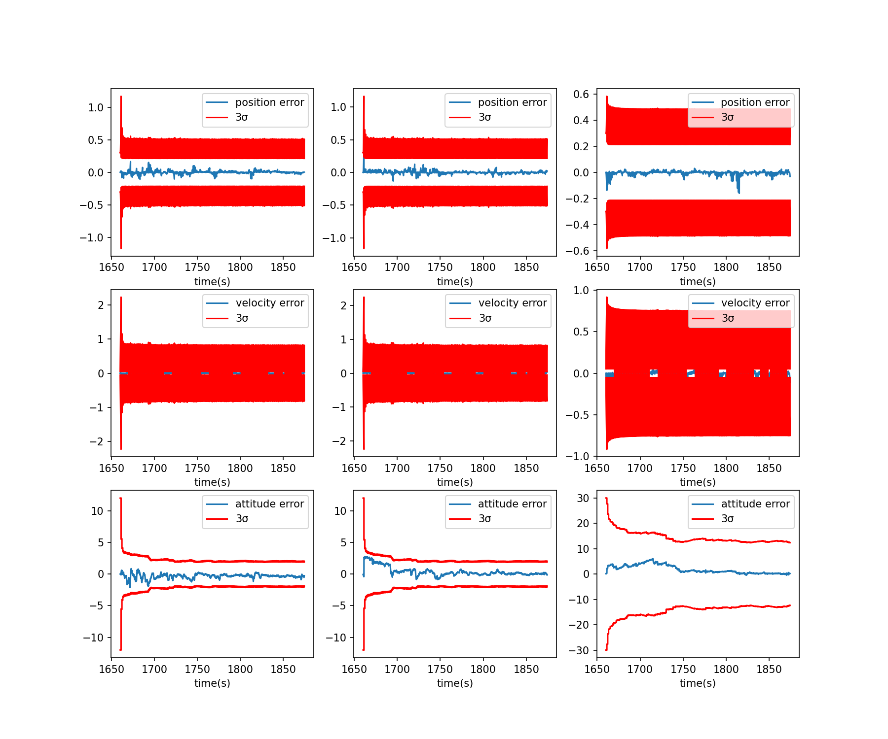
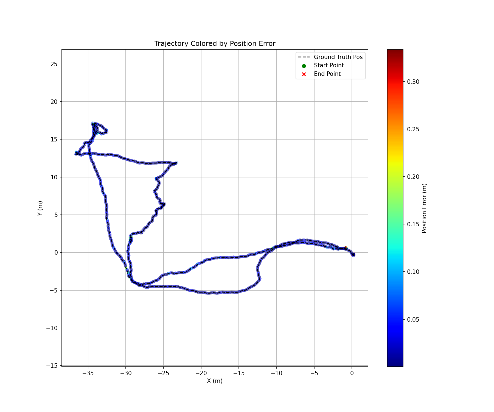

# KF-GINS-Python

这是一个参考 [KF-GINS](https://github.com/i2Nav-WHU/KF-GINS) 思路编写的 Python 组合导航示例程序。当前版本以相对位置、速度、姿态和 IMU 误差状态为核心，读取文本格式的 IMU、GNSS 和参考轨迹数据，运行滤波解算后输出导航结果、状态标准差、IMU 误差估计，并自动绘制结果图。

## 1. 致谢

本项目参考了武汉大学 i2Nav 团队开源的 [KF-GINS](https://github.com/i2Nav-WHU/KF-GINS) 项目，在此表示感谢。

示例数据采用了 [TLIO](https://github.com/CathIAS/TLIO) 项目提供的数据集，在此感谢 TLIO 项目作者和维护者的开源工作。

## 2. 项目结构

```text
KF-GINS-Python/
├── main.py                  # 主程序入口，读取配置、运行组合导航、输出结果
├── plotResult.py            # 结果绘图脚本，main.py 结束后会自动调用
├── environment.yaml         # Conda 环境配置
├── dataset/
│   ├── kf-gins.yaml         # 程序配置文件
│   └── 146734859523827/
│       ├── IMU.txt          # IMU 输入数据
│       ├── GNSS.txt         # GNSS 输入数据
│       └── GT.txt           # 参考轨迹/真值数据
├── output/                  # 解算结果和绘图输出目录
└── src/
    ├── INSMech.py           # 惯导机械编排相关函数
    ├── gi_engine_class.py   # GNSS/INS 组合导航滤波引擎
    └── other_class.py       # 数据结构、文件加载器和姿态工具函数
```

## 3. 环境配置

在项目根目录创建并激活 Conda 环境：

```bash
conda env create -f environment.yaml
conda activate KF-GINS-Python
```

如果环境已存在，可以更新：

```bash
conda env update -f environment.yaml --prune
```

主要依赖包括 `numpy`、`scipy`、`PyYAML`、`matplotlib`、`pyqt` 和 `numpy-quaternion`。

## 4. 配置文件

程序默认读取：

```text
dataset/kf-gins.yaml
```

常用配置项：

```yaml
input_path: "./dataset/146734859523827"
output_path: "./output"
imudatarate: 200
gnssdatarate: 1
```

- `input_path`：输入数据目录，目录下需要包含 `IMU.txt`、`GNSS.txt`、`GT.txt`。
- `output_path`：结果输出目录。
- `imudatarate`：IMU 数据频率，用于初始化 IMU 文件读取器。
- `imunoise`：IMU 噪声、零偏、比例因子等滤波参数。
- `initposstd`、`initvelstd`、`initattstd`：初始位置、速度和姿态标准差。

## 5. 数据格式

输入数据均为文本文件，使用空格分隔。

### 5.1 IMU.txt

每行 7 列：

```text
time gyro_x gyro_y gyro_z acc_x acc_y acc_z
```

- `time`：时间戳，单位 s
- `gyro_*`：三轴陀螺仪角速度，单位 rad/s
- `acc_*`：三轴加速度计比力，单位 m/s^2

### 5.2 GNSS.txt

每行 7 列：

```text
time x y z vx vy vz
```

- `time`：时间戳，单位 s
- `x y z`：位置，单位 m
- `vx vy vz`：速度，单位 m/s

### 5.3 GT.txt

每行 14 列：

```text
time x y z vx vy vz roll pitch yaw qw qx qy qz
```

- `x y z`：参考位置，单位 m
- `vx vy vz`：参考速度，单位 m/s
- `roll pitch yaw`：参考欧拉角，单位 deg
- `qw qx qy qz`：姿态四元数，表示 device to world

`GT.txt` 用于初始化导航状态，并在 `plotResult.py` 中计算误差和绘制对比结果。

## 6. 运行

在项目根目录执行：

```bash
python main.py
```

程序流程：

1. 读取 `dataset/kf-gins.yaml`
2. 加载 `IMU.txt`、`GNSS.txt`、`GT.txt`
3. 使用 `GT.txt` 的指定行初始化位置、速度和姿态
4. 初始化 IMU 噪声和滤波参数
5. 运行 GNSS/INS 组合导航滤波
6. 写入文本结果到 `output/`
7. 自动运行 `plotResult.py` 生成结果图

## 7. 输出结果

运行完成后，`output/` 目录会生成：

```text
KF_GINS_Navresult.txt
KF_GINS_IMU_ERR.txt
KF_GINS_STD.txt
KF_GINS_Result.png
KF_GINS_Trajectory_Error_Color.png
```

### 7.1 KF_GINS_Navresult.txt

导航结果文件，主要包含：

```text
flag time x y z vx vy vz roll pitch yaw qw qx qy qz
```

其中 `flag` 当前固定写入 `0`。

### 7.2 KF_GINS_IMU_ERR.txt

IMU 误差估计结果：

```text
time gyrbias_x gyrbias_y gyrbias_z accbias_x accbias_y accbias_z gyrscale_x gyrscale_y gyrscale_z accscale_x accscale_y accscale_z
```

### 7.3 KF_GINS_STD.txt

滤波状态标准差：

```text
time pos_std_3 vel_std_3 att_std_3 gyrbias_std_3 accbias_std_3 gyrscale_std_3 accscale_std_3
```

姿态标准差输出为角度单位。

### 7.4 图像结果

- `KF_GINS_Result.png`：位置、速度、姿态误差及 3σ 边界。
- `KF_GINS_Trajectory_Error_Color.png`：按位置误差着色的轨迹图，并叠加参考轨迹。





如果运行环境支持图形界面，`plotResult.py` 会通过 Matplotlib 弹出图窗；如果不弹窗，也可以直接查看 `output/` 中保存的 PNG 文件。

## 8. 注意事项

- 运行脚本时建议位于项目根目录，否则相对路径配置可能无法正确读取。
- `output_path` 指向的目录需要提前存在。
- `plotResult.py` 依赖 `GT.txt` 与导航结果在时间戳上能够匹配，默认匹配阈值为 `0.005 s`。
- 如果 Matplotlib 图窗无法显示，请确认环境中已安装 `pyqt`，或直接查看输出 PNG 文件。
